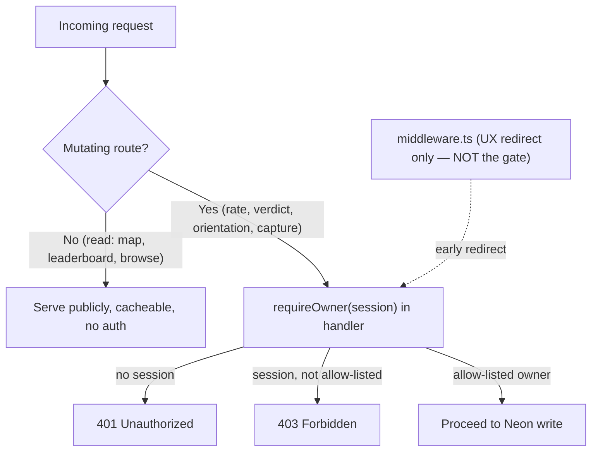
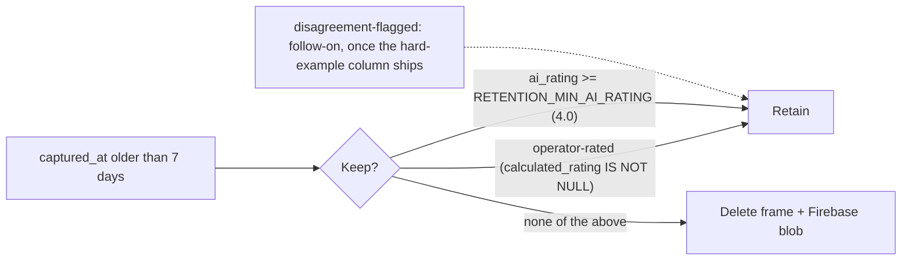

# feat: Public/private split — gated studio, owner auth, best-sunset leaderboard, retention

## Summary

Split the Sunrise/Sunset site into a public read-only hub and an owner-only private studio by gating the existing single drawer rather than building a separate admin app. Introduce Auth.js v5 (single allow-listed Google account, JWT sessions, no DB adapter), enforce a `requireOwner` check on every mutating API route, add a public best-sunset leaderboard ranked by each snapshot's stored `ai_rating`, and replace the flat 7-day cleanup with a retention union that keeps operator-rated, high-`ai_rating`, and disagreement-flagged frames so the all-time leaderboard persists.

---

## Problem Frame

The whole site is public and unauthenticated today. The drawer (`app/HomeClient.tsx`) already mixes public-worthy views with operator tooling, and four data-mutating routes accept writes from anyone with no session check — the only "identity" is a spoofable anonymous UUID in `localStorage` (`app/lib/userSession.ts`). That leaves the rating data that trains and tunes the model open to anyone. Research also surfaced a live security issue: the pinned Next.js `15.5.9` is vulnerable to a middleware-bypass CVE (CVE-2026-44575, fixed in `15.5.18`), so middleware cannot be the auth boundary and the version must be bumped before auth is relied upon.

At the same time the product wants two faces from one site: a public surface that conveys the project by *showing* it (live map + leaderboards) and a private studio for rating, auditing models against live skies, and managing the archive. This plan delivers both and resolves the `calculated_rating` "crowd average" contradiction the brainstorm surfaced. See origin: `docs/brainstorms/2026-06-02-public-private-split-requirements.md`.

---

## High-Level Technical Design

Auth posture — middleware is a UX redirect only; the route handler is the authorization boundary:

Retention union — a frame survives the 7-day cleanup if any class holds:

---

## Requirements

These trace to the origin requirements doc (R1–R19); R20–R21 are introduced by planning research. Grouped by concern.

**Authentication & write-gating**
- R1. Only a pre-approved allow-listed Google account authenticates as the operator; everyone else is public/anonymous. (origin R1)
- R2. Every data-mutating API route verifies the operator session server-side and rejects unauthenticated/unauthorized requests — explicitly the four currently-open routes. Cron and camera-device routes keep their existing secret/device-token auth. (origin R2)
- R3. All read endpoints powering the public surface remain accessible without authentication. (origin R3)
- R4. The hub provides a sign-in/sign-out affordance; signed-in state visibly unlocks studio capabilities. (origin R4)
- R21. Next.js is upgraded to a release without the known middleware-bypass CVE (≥ 15.5.18) before auth gating is relied upon. (planning)

**Public surface (read-only)**
- R5. The public lands on the live map, no login required. (origin R5)
- R6. The drawer renders read-only for the public: Current Sunrises/Sunsets (view), Snapshot Archive, Curated, Model Analysis. No edit controls, no Unrated Queue. (origin R6)
- R7. The best-sunset leaderboard is part of the public surface. (origin R7)

**Private studio (authenticated)**
- R8. Signed in, the drawer exposes edit controls inline: snapshot rating, webcam rating, webcam orientation. (origin R8)
- R9. The Unrated Queue is available only when signed in. (origin R9)
- R10. Any verdict / hard-example labeling UI is available only when signed in. (origin R10)
- R11. Signed-in review ("dummy-check"): the operator reviews live sunrises/sunsets alongside their current `ai_rating` to confirm the pipeline updates and rates correctly — reusing the existing live view and stored scores, no new inference. (origin R11)
- R12. Destructive actions (cleanup) stay gated and are never exposed to the public UI. (origin R12)

**Best-sunset leaderboard**
- R13. The leaderboard ranks by each snapshot's stored `webcam_snapshots.ai_rating` — the rating assigned by whichever model scored it — not the human `calculated_rating`. (origin R13)
- R14. The leaderboard supports groupings and windows: overall, per-webcam, per-country, across "now", "today", and "all-time". (origin R14)
- R15. Primary surface is a public drawer tab; shareable deep-link routes are a deferred extension. (origin R15)

**Ratings & data posture**
- R16. Anonymous public rating writes are disabled; the rating write path is operator-gated. (origin R16)
- R17. The ratings schema (`webcam_snapshot_ratings`, `user_session_id`) is retained so crowd rating can be re-enabled later without redesign. (origin R17)
- R18. `ai_rating` is the leaderboard signal; `calculated_rating` is retained for review/labeling but does not drive the leaderboard. (origin R18)
- R19. A frame older than the cleanup window is retained if it is operator-rated OR has `ai_rating ≥ RETENTION_MIN_AI_RATING` OR is disagreement-flagged, so the best-of archive and all-time leaderboard persist. (origin R19)
- R20. Per-snapshot `ai_rating` is populated on all insert paths (cron already does; add `capture-and-rate` and custom-cam snapshots) so frames are rankable and retention-eligible. (planning)

---

## Key Technical Decisions

- KTD1. **Auth.js v5 (`next-auth@beta`, 5.0.0-beta.x) with JWT sessions, no DB adapter.** Single-owner gating needs only identity at sign-in, so JWT sessions avoid Neon adapter tables and keep middleware Edge-safe. Google provider; `AUTH_SECRET`/`AUTH_GOOGLE_ID`/`AUTH_GOOGLE_SECRET` env. Reject every non-allow-listed account in the `signIn` callback (defense-in-depth) AND re-check per route. Because JWT sessions can't be server-invalidated, set a modest session `maxAge` and have the client handle a 401/403 by surfacing "session expired — sign in again" (see U6) rather than failing silently.
- KTD2. **Bump Next.js 15.5.9 → ≥ 15.5.18 first.** CVE-2026-44575 lets a crafted segment-prefetch resolve a protected route without the middleware matcher firing. Auth must not sit on a vulnerable version; this also reinforces "middleware is UX only."
- KTD3. **One `requireOwner(session)` guard, enforced in every mutating handler; middleware is redirect UX only.** A server-only `app/lib/owner.ts` reads an env email allow-list (`OWNER_EMAILS`) and returns owner/not. Keep it flat named functions (`isOwner`/`requireOwner`) — no capability enum or role hierarchy now; if raters arrive later, add a peer `requireRater`. Return 401 (no session) / 403 (session, not owner); never 404-mask (resources are public on the read side).
- KTD4. **`snapshots/[id]/rate` (POST/DELETE) and `capture-and-rate` (POST) become owner-only now.** Public rating is deferred, so these gate to the owner. The `webcam_snapshot_ratings` table and `user_session_id` column stay in place (R17) so crowd rating can switch on later. Do not drop or fold them.
- KTD5. **Populate per-snapshot `ai_rating` across the scoring paths — a real prerequisite, not a tidy-up.** Today only the Windy cron insert (`insertSnapshotRecord`) writes `webcam_snapshots.ai_rating`. `capture-and-rate` inserts store no score at all; custom-cam scoring writes `webcams.ai_rating_regression` (per-webcam) and `webcam_snapshots.ai_regression_score` on a *later* backfill sweep, not at insert. The raw→1–5 mapping (`1 + raw*4`) is forked ~4× and **not exported** (`aiScoring.ts` `ratingFromRaw`/`normalizeRegressionOutput`, an inline in the cron route, a SQL inline in `dbOperations.ts`), so there is no single function to reuse yet. U7 must therefore (a) extract one exported mapping with an explicit clamp+round contract and move the call sites onto it, (b) populate `ai_rating` for custom-cam frames at the scoring/backfill step where the raw score exists (two-phase: NULL at insert, set at score), (c) decide `capture-and-rate`'s source — route it through scoring rather than its bare insert — and (d) run a real historical backfill (mandatory, not optional). Rows with genuinely no score stay NULL and are excluded from ranking.
- KTD6. **Leaderboard = a single cached `GROUP BY` aggregate over `webcam_snapshots`, joined to `webcams` for `country`.** Rank by `ai_rating`; window via `captured_at`; group overall / per `webcam_id` / per `webcams.country` (NULL country → "Unknown" bucket; custom cams have no country). Explicit column allow-list (never expose `user_session_id` or `device_token_hash`); exclude NULL `ai_rating`. Cache with `revalidate`/`s-maxage ≈ 60s` (optionally a Redis-cached ranking, mirroring the cron's cache discipline). Keep the route `auth()`-free so it stays cacheable for anonymous visitors.
- KTD7. **Retention is a union, applied atomically, scheduled only after a dry-run.** The current cleanup protects *nothing* (flat 7-day delete, no exclusions), so the full exclusion must land as one non-decomposable change — no intermediate deploy may delete rated frames. v1 union: delete where older than the window AND NOT (operator-rated OR `ai_rating ≥ RETENTION_MIN_AI_RATING`). **The disagreement-flagged class is descoped from v1** — no `disagreement`/`model_disagreement_kind` column exists in any migration (it lives only in the unshipped hard-example-mining spec); add that retention class as a follow-on once that migration ships (see Open Questions, U11). Pin **operator-rated = `calculated_rating IS NOT NULL`** (one definition, not "rating row OR calculated_rating"). Add `RETENTION_MIN_AI_RATING = 4.0` to `app/lib/masterConfig.ts` (≈ 0.75 normalized-regression per the normalized-vs-raw learning; droppable to 3.5). Remove the `NODE_ENV === 'development'` auth bypass in the cleanup route as part of this work. Scheduling the cron is a **separate unit (U11)** that only lands after the U10 dry-run counts are reviewed.
- KTD8. **Drawer gating via client session; tabs keyed stably.** Add `SessionProvider` and derive `isOperator` from the session in the client drawer; conditionally render the Unrated Queue tab and inline edit controls. Key tabs by a stable id rather than positional index (hiding the Unrated Queue tab would otherwise shift later indices). The client gate is cosmetic — server `requireOwner` is the real control.

---

## Implementation Units

Phased. U-IDs are stable; dependencies cite U-IDs.

### Phase 1 — Auth foundation

### U1. Upgrade Next.js past the middleware-bypass CVE
- Goal: Move off the vulnerable `15.5.9` to `≥ 15.5.18` so auth gating isn't built on a bypassable version.
- Requirements: R21
- Dependencies: none
- Files: `package.json`, `package-lock.json`, `next.config.ts` (verify no breaking config), CI/build config if any.
- Approach: Bump `next` to the latest `15.5.x ≥ 15.5.18`. Confirm `serverExternalPackages: ['onnxruntime-node', 'sharp']` and `outputFileTracingIncludes` (ONNX bundling) still behave. Watch the App Router 15.5.x changelog for any route-handler/`params` changes.
- Patterns to follow: existing `next.config.ts`.
- Execution note: Bump and run the full build + existing Vitest suite before any other unit; treat a green build as the gate.
- Test scenarios: `Test expectation: regression-only` — `npm run build` succeeds; existing Vitest suite passes; a cron smoke returns real (non-baseline) ONNX scores (100–500ms, not 10–20ms — silent-ML-fallback learning); **a `[id]`-param route smoke confirms `id` still binds correctly** (guards against any App-Router `params` change across the 9-patch jump, since every gated route uses `params: Promise<{ id }>`).
- Verification: Build green, suite green, cron smoke returns real scores, `[id]` binding confirmed.

### U2. Add Auth.js v5 with Google provider and owner allow-list
- Goal: Stand up authentication with sign-in restricted to the single owner account.
- Requirements: R1, R4
- Dependencies: U1
- Files: `auth.ts` (repo root), `app/api/auth/[...nextauth]/route.ts`, `.env.local` (+ Vercel env), `package.json`.
- Approach: `npm install next-auth@beta`. `auth.ts` exports `{ handlers, auth, signIn, signOut }`, configures the Google provider, and in the `signIn` callback rejects unless **both** conditions hold — write the predicate explicitly: `profile?.email_verified === true && OWNER_EMAILS.includes(profile.email?.toLowerCase())` (a matching-but-unverified email must be rejected). Env: `AUTH_SECRET`, `AUTH_GOOGLE_ID`, `AUTH_GOOGLE_SECRET`, `OWNER_EMAILS`. JWT sessions (no adapter); set a modest `session.maxAge`. Register the Google OAuth client + `/api/auth/callback/google` redirect URIs (prod + localhost). `AUTH_TRUST_HOST`/`AUTH_URL` not needed on Vercel.
- Patterns to follow: Auth.js v5 docs (authjs.dev); env access mirrors the existing `process.env.X` style.
- Test scenarios:
  - Happy path: an allow-listed verified Google email completes sign-in and `auth()` returns a session with that email.
  - Error path: a non-allow-listed email is rejected by the `signIn` callback (no session established).
  - Edge case: a Google account with `email_verified !== true` is rejected even if the address matches the allow-list.
- Verification: Signing in as the owner yields a session; any other account is denied.

### U3. `requireOwner` guard helper
- Goal: One server-side authority for "who may write," reusable across routes.
- Requirements: R1, R2
- Dependencies: U2
- Files: `app/lib/owner.ts` (`import 'server-only'`), test alongside per repo convention.
- Approach: `isOwner(session)` checks the session email (lowercased) against `OWNER_EMAILS`. Expose `isOwner(session)` and `requireOwner(session)` as plain named functions the handlers use; do not build a capability enum or role hierarchy — if raters arrive later, add a peer `requireRater`. Sit beside existing auth idioms (`app/lib/cameraAuth.ts`, `app/api/cron/update-cameras/lib/auth.ts`).
- Patterns to follow: `app/api/cron/update-cameras/lib/auth.ts` (`verifyCronAuth`) as the "small reusable verifier" shape.
- Test scenarios:
  - Happy path: a session whose email is in `OWNER_EMAILS` → owner.
  - Error paths: null session → not owner; session email not in list → not owner; case/whitespace variations in the env list are normalized.
- Verification: Unit tests cover owner / non-owner / no-session.

### Phase 2 — Gate writes & turn public rating off

### U4. Gate the four mutating routes; disable anonymous rating
- Goal: Close the open write surface; owner-only writes; public rating off.
- Requirements: R2, R3, R16, R17
- Dependencies: U3
- Files: `app/api/snapshots/[id]/rate/route.ts` (POST + DELETE), `app/api/snapshots/capture-and-rate/route.ts` (POST), `app/api/webcams/[id]/rating/route.ts` (PATCH), `app/api/webcams/[id]/orientation/route.ts` (PATCH), **`app/api/webcams/[id]/route.ts` (PATCH — the generic webcam route that writes both `rating` and `orientation`; currently ungated, omitted from the origin's four-route count — gate or retire it)**; tests alongside each.
- Approach: At the top of each handler, `const session = await auth();` then `requireOwner` → 401 (no session) / 403 (not owner) before any validation or write, using the explicit `await auth()` style (composes with the existing `params: Promise<…>` signatures and the Node runtime these routes need). Audit `app/api/webcams/[id]/route.ts` first — its own comment says "this might not be necessary"; if dead, delete it, else gate it. Leave cron routes on `CRON_SECRET` and camera-device routes on `cameraAuth`. **Resolve `app/api/snapshots/capture/route.ts` (POST, currently ungated): add `CRON_SECRET` if it's cron-only, or gate/confirm it's unreachable externally.** `app/api/admin/claim-codes` stays on `CRON_SECRET` by design (provisioning) — note that the cron secret now also gates hardware provisioning and should be rotated independently of session compromise. Do not touch read routes. Keep `webcam_snapshot_ratings` / `user_session_id` intact (R17) — gating, not removal. Owner rating writes continue to carry the anon `userSessionId` as the `webcam_snapshot_ratings` key until a future `rated_by_email` column lands (deferred).
- Patterns to follow: existing route shape in `app/api/snapshots/[id]/rate/route.ts`; secret-check precedent in `app/api/snapshots/cleanup/route.ts`.
- Execution note: Fail closed from the first commit — no "log-but-allow" grace period (there is exactly one legitimate writer).
- Test scenarios:
  - Covers AE1. Error path: unauthenticated `POST /api/snapshots/{id}/rate` → 401, no row written.
  - Error path: authenticated non-owner → 403, no write.
  - Happy path: owner session → existing rate/orientation behavior unchanged (write succeeds, `calculated_rating` recomputed).
  - Integration: each of the four routes rejects anon and accepts owner (parametrized).
  - Regression: confirm no client caller sends `credentials: 'omit'` that would drop the session cookie.
- Verification: `curl -X PATCH /api/webcams/1/rating` with no cookie → 401; owner-session call → 200. Post-deploy smoke asserts anon→401 / owner→200 on all four.

### Phase 3 — Client session & drawer split

### U5. Client session wiring + sign-in/out affordance
- Goal: Expose authenticated state to the client drawer and let the owner sign in/out.
- Requirements: R4
- Dependencies: U2
- Files: `app/layout.tsx` (or the client root), a new `SessionProvider` wrapper, a small sign-in/out control component.
- Approach: Add a dedicated `'use client'` `SessionProvider` wrapper component imported into the server `app/layout.tsx` — do NOT add `'use client'` to `layout.tsx` itself (it exports `metadata`); alternatively host the provider in the already-client `HomeClient.tsx`. Expose `isOperator` via `useSession()`. Place the sign-in/out affordance at a fixed, always-visible spot (e.g. pinned at the bottom of the drawer panel below the tabs): "Sign in" when logged out, email + "Sign out" when logged in. Sign-in triggers the Google flow. Keep `app/lib/userSession.ts` (anon UUID) for now — unrelated plumbing, not the auth identity.
- Patterns to follow: Auth.js `SessionProvider`/`useSession`.
- Test scenarios:
  - Happy path: signed-in session → `isOperator === true`; signed-out → `false`.
  - Edge case: loading/`status === 'loading'` renders as non-operator (no flash of controls).
- Verification: Toggling sign-in flips `isOperator` and the affordance label.

### U6. Gate the drawer: read-only public vs operator studio
- Goal: One drawer that renders read-only for the public and unlocks controls + the Unrated Queue for the owner.
- Requirements: R5, R6, R8, R9, R10, R11, R12
- Dependencies: U5
- Files: `app/HomeClient.tsx` (tab list + `tabValue === N` blocks), `app/components/WebcamConsole.tsx`, `app/components/SnapshotConsole.tsx`, `app/components/Rating/*`, any verdict/hard-example UI if present.
- Approach: Key tabs by a stable id, not positional index, so hiding the Unrated Queue for the public doesn't shift later tabs. Derive `isOperator = session?.user && status !== 'loading'`. When `!isOperator`: omit the Unrated Queue tab and **do not render** rating/orientation/verdict controls at all (conditional render, not CSS-hidden, not disabled) — confirm the snapshot/webcam card layout doesn't leave an empty gap where the rating widget was. During `status === 'loading'`, render the same read-only public view (no drawer-level spinner) so the tab list is stable and there's no flash/reflow when the session resolves. When `isOperator`: show controls + the Queue. On a write returning 401/403 (e.g. an expired JWT while the cached drawer still shows controls), surface "session expired — sign in again" and re-check the session — never let the click silently no-op. The live "dummy-check" (R11) is the existing Current Sunrises/Sunsets view shown with its `ai_rating` — no new component. Server enforcement (U4) remains the real gate; this is presentation.
- Patterns to follow: existing `<Tabs>`/`tabValue === N` rendering in `app/HomeClient.tsx`; control trees in the consoles.
- Test scenarios:
  - Covers AE2, AE3. Public: no edit controls render; Unrated Queue tab absent; read-only browse works.
  - Operator: edit controls render; Unrated Queue present; writes call the (now gated) routes.
  - Edge case: tab indices stay correct for the public with the Queue hidden (no off-by-one).
- Verification: Logged-out and logged-in renders match R6/R8/R9; no console errors from index drift.

### Phase 4 — Rankable data

### U7. Populate per-snapshot `ai_rating` across scoring paths + backfill
- Goal: Give every *scored* snapshot a comparable per-snapshot `ai_rating` so the leaderboard and retention have real data — today only the Windy cron path writes it.
- Requirements: R20 (enables R13, R19)
- Dependencies: none (independent of auth); a completed, verified backfill is a hard gate for U8 and U10
- Files: `app/api/cron/update-cameras/lib/aiScoring.ts` (extract+export the mapping), call sites that fork the mapping (`app/api/cron/update-cameras/route.ts`, `app/api/cron/update-cameras/lib/dbOperations.ts`), the custom-cam scoring/backfill path (`app/lib/cameraSnapshot.ts` / the existing custom backfill), `app/api/snapshots/capture-and-rate/route.ts`, a backfill script under `scripts/` or `ml/`.
- Approach:
  1. **Extract one mapping.** Export a single `ratingFromRaw(raw)` with an explicit clamp-to-[0,1] + rounding contract; refactor the ~4 forked sites (`ratingFromRaw`/`normalizeRegressionOutput` in `aiScoring.ts`, the inline `1 + raw*4` in the cron route, the SQL-inline in `dbOperations.ts`) onto it. This is the prerequisite — there is no shared function today.
  2. **Custom-cam:** write `webcam_snapshots.ai_rating = ratingFromRaw(ai_regression_score)` at the scoring/backfill step where the raw score first exists (two-phase: NULL at insert, set at score) — not at the bare insert.
  3. **`capture-and-rate`:** route these inserts through the shared scoring path so they get an `ai_rating` (decided) — reuse the same scoring step, not ad-hoc inline inference. Be mindful of ONNX latency/bundling on this user path (silent-ML-fallback learning); if blocking latency is a problem, score asynchronously right after the insert (still via the shared path) rather than in the request critical path. Do not leave these NULL.
  4. **Backfill** historical rows where a raw score exists (mandatory). Rows with no score stay NULL and are excluded from ranking.
- Patterns to follow: the existing mapping math in `aiScoring.ts`; the custom backfill sweep; `dbOperations.ts` helpers.
- Test scenarios:
  - Integration: a single exported `ratingFromRaw` is the only mapping used by cron, custom-cam, and capture paths (assert call sites import it; no inline `1 + raw*4` remains).
  - Happy path: a custom-cam snapshot with `ai_regression_score = r` ends up with `ai_rating = ratingFromRaw(r)` after the scoring step.
  - Edge cases: `raw > 1` / `raw < 0` clamp identically everywhere; a freshly-inserted custom-cam row is NULL-then-populated (two-phase), not populated-at-insert.
  - Edge case: a snapshot with no score keeps `ai_rating = NULL` and is excluded from leaderboard queries.
  - Backfill: after running, `count(ai_rating IS NOT NULL)` is non-trivial across camera classes.
- Verification: One exported mapping in use everywhere; backfill executed and the non-NULL count reviewed; this count is the gate U8/U10 check before proceeding.

### Phase 5 — Leaderboard

### U8. Best-sunset leaderboard API
- Goal: A public, cacheable ranking endpoint by `ai_rating` across groupings and windows.
- Requirements: R7, R13, R14, R18
- Dependencies: U7 (its backfill executed + the non-NULL `ai_rating` count verified — not merely "U7 landed"; otherwise every window returns near-empty)
- Files: `app/api/leaderboards/route.ts` (new), tests alongside.
- Approach: A single `GROUP BY` aggregate over `webcam_snapshots` joined to `webcams`. Query params select grouping (`overall` | `webcam` | `country`) and window (`now` | `today` | `all-time` via `captured_at` filters). Rank by `ai_rating` (exclude NULL). Group per-country on `webcams.country` with a NULL → "Unknown" bucket. **Define a TypeScript projection type listing only the allowed columns and match the SELECT to it — never `SELECT *` on a joined table; never expose `user_session_id` or `device_token_hash`** (the allow-list must be structural, not just test-caught). Cache via `revalidate`/`Cache-Control: s-maxage=60, stale-while-revalidate`; consider a Redis-cached ranking keyed by grouping+window (mirror the cron's cache discipline). No `auth()` on this route. Prefer parameterized `${}`; only use `sql.unsafe` for validated grouping/order tokens, following `app/api/snapshots/route.ts`. **Keep frame-selection a swappable strategy** — ranking by `ai_rating` is one selection mode; a good/bad/edge-case labeling mix (like Curated) is a plausible future mode — so the endpoint can be rerouted into a rating/labeling surface later without a query rewrite. Note (carried to U9): until backfill coverage is broad, the board is effectively Windy-only and "all-time" mixes model versions — surface that honestly in the UI.
- Patterns to follow: the read query in `app/api/snapshots/route.ts` (already selects `ai_rating`, `country`, `lat`, `lng`); DB client `app/lib/db.ts`.
- Test scenarios:
  - Happy path: overall/all-time returns snapshots ordered by `ai_rating` desc.
  - Covers AE4. Ordering reflects `ai_rating`, not `calculated_rating`.
  - Edge cases: per-country buckets group correctly; NULL-country rows fall into "Unknown"; NULL `ai_rating` rows excluded; "today" filters by `captured_at`.
  - Security: response contains no `user_session_id` / `device_token_hash`; column allow-list enforced.
  - Performance: a single aggregate query (no N+1 per webcam); covering index used.
- Verification: Endpoint returns ranked results per grouping/window; column allow-list verified; cache headers present.

### U9. Best Sunsets public drawer tab
- Goal: Surface the leaderboard in the drawer for everyone.
- Requirements: R7, R15, R6
- Dependencies: U8
- Files: `app/HomeClient.tsx` (add a public tab), `app/components/Leaderboard/*` (new).
- Approach: A new always-public "Best Sunsets" tab (stable-keyed per U6), fetched via SWR from U8. Build leaderboard cards to reuse the same gated rating control component as the consoles (renders only for the operator per U6) so the board can later double as a rating/labeling surface without a rewrite. Render grouping and window as two independent segmented controls (overall/per-webcam/per-country and now/today/all-time), defaulting to **overall / all-time** on open; selection change refetches. Empty result → a message like "No sunsets scored yet for this window — try All-time."; the NULL-country group renders as "Location unknown" with its count (don't suppress it). Surface a one-line coverage caveat ("ranks scored frames; some cameras aren't scored yet") so partial `ai_rating` coverage isn't read as comprehensive. Read-only; visible logged-out and logged-in. Shareable deep-link routes deferred (Scope Boundaries).
- Patterns to follow: existing tab rendering and SWR usage in the consoles; segmented controls mirror the drawer's tab-heavy idiom.
- Test scenarios:
  - Happy path: the tab renders ranked entries for the default overall/all-time view.
  - Edge cases: a zero-result window shows the empty-state copy (not a crash); the "Unknown" country bucket renders labeled; switching either control refetches.
  - Public visibility: the tab is present and read-only when logged out.
  - Coverage caveat is visible.
- Verification: Tab shows live rankings for anonymous and owner sessions alike.

### Phase 6 — Retention

### U10. Retention union predicate + threshold config + dry-run (NO schedule yet)
- Goal: Stop deleting valuable frames so the all-time leaderboard persists — applied atomically, verified by dry-run, but not yet scheduled.
- Requirements: R19 (supports R14 all-time)
- Dependencies: U7 (its backfill executed + non-NULL `ai_rating` count verified — the `ai_rating` retention class is empty otherwise, making this functionally identical to the old flat delete)
- Files: `app/api/snapshots/cleanup/route.ts`, `app/lib/masterConfig.ts`.
- Approach: Replace the flat "older than 7 days" delete with one atomic predicate: delete where older than the window **AND NOT** (`calculated_rating IS NOT NULL` **OR** `ai_rating ≥ RETENTION_MIN_AI_RATING`). Pin operator-rated to `calculated_rating IS NOT NULL` (single definition — note the current cleanup protects *nothing* today, so this is the first exclusion, not an extension). **Disagreement-flagged is descoped from v1** — no such column exists in `database/migrations/`; it ships as a follow-on once the hard-example-mining migration lands (see Open Questions). Add `RETENTION_MIN_AI_RATING = 4.0` to `masterConfig` (comment: ≈0.75 normalized-regression; 3.5 is a one-line change). **Remove the `NODE_ENV === 'development'` auth bypass** in the cleanup route — require `CRON_SECRET` unconditionally in any deployed environment. Treat NULL `ai_rating` as "not high."
- Patterns to follow: existing `cleanup` route + `CRON_SECRET` check; threshold constants alongside `AI_SNAPSHOT_*` in `masterConfig`.
- Execution note: Land the three-part change (predicate + threshold const + bypass removal) as one commit. The dry-run is an **acceptance gate, not a note**: run the new predicate as a counting query (would-delete vs would-retain, broken out by retention class) against production data and record the counts before U11 ships any schedule. The route stays manual-trigger-only after this unit.
- Test scenarios:
  - Covers AE5. A snapshot with `ai_rating ≥ threshold` past the window is retained.
  - Retained: an operator-rated frame with low/NULL `ai_rating` (e.g. a hand-rated silhouette) survives via `calculated_rating IS NOT NULL`.
  - Deleted: an unrated, low/NULL-`ai_rating` frame past the window is deleted (row + Firebase blob).
  - Edge case: NULL `ai_rating` is "not high" (not retained on that basis alone).
  - Security: `GET /api/snapshots/cleanup` without `CRON_SECRET` is rejected even when `NODE_ENV === 'development'` is simulated for a deployed env.
- Verification: Dry-run counts reviewed and recorded; predicate + bypass-removal landed atomically; route not yet scheduled.

### U11. Schedule the cleanup cron
- Goal: Make retention active on a daily cadence — only after U10's dry-run is reviewed.
- Requirements: R19 (operationalizes it)
- Dependencies: U10 (dry-run counts reviewed and acceptable)
- Files: `vercel.json` (add the daily cleanup cron entry; keep the `CRON_SECRET` gate).
- Approach: Add a daily schedule for `app/api/snapshots/cleanup`. Because Vercel cron timing isn't gated on a human, this unit must not land until the U10 dry-run has been reviewed — the first scheduled run permanently deletes Firebase blobs + rows.
- Patterns to follow: the existing `update-cameras` cron entry shape in `vercel.json`.
- Test scenarios: `Test expectation: config-only` — confirm the cron entry is well-formed and targets the gated route; verify (in a deployed check) the scheduled invocation carries the `CRON_SECRET`.
- Verification: After enabling, a scheduled run retains high/rated frames and removes only genuinely-disposable ones; spot-check the first run's deletion count against the U10 dry-run estimate.

---

## Scope Boundaries

**Deferred for later** (origin-carried)
- On-demand / multi-model live inference for candidate-model comparison — its own capability (compute, latency, bundling, silent-fallback) on the ML-quality track; needs its own brainstorm.
- Public accounts and crowd rating at scale — schema kept ready (R17); enabling is out of scope.
- Shareable leaderboard deep-link routes — a fast-follow after the tab.
- Leaderboard as a rating/labeling surface — the board doubling as a place to rate, mixing good/bad/edge-case frames (like Curated) rather than a pure best-only ranking. U8/U9 are built reroutable (swappable frame-selection + reused gated rating controls) so this is additive, not a rewrite.

**Deferred to follow-up work** (plan-local)
- The disagreement-flagged retention class + its partial index — ships with the hard-example-mining migration (the column doesn't exist yet).
- Reverse-geocoding custom-cam (`cameras` table) lat/lng into a country so they leave the "Unknown" bucket.
- A `requireRater` tier / `rated_by_email` column — `requireOwner` is a plain named function now; add a peer when raters arrive (KTD3).

**Outside this product's identity (for now)** (origin-carried)
- Multi-user roles/permissions beyond a single operator (no RBAC engine).

---

## System-Wide Impact

- **New auth boundary.** The app gains its first real authentication. Every future mutating route must adopt `requireOwner`; document this so it becomes the default (and surfaces in `CLAUDE.md`/`docs/solutions/gate-writes-at-api-layer.md`).
- **Data lifecycle change.** Retention moves from "delete everything > 7 days" to a selective union, and cleanup becomes scheduled. This permanently deletes Firebase blobs — the dry-run gate (U10) is load-bearing.
- **Public read posture.** Reads must stay anonymous and cacheable; accidentally adding `auth()` to a read path would break anonymous visitors and caching.
- **Cost/perf.** A public leaderboard is a new high-traffic read; caching (KTD6) keeps it off the DB hot path.
- **Secret/debug surface.** After this lands, the operator session is a short-lived JWT and `CRON_SECRET` becomes the only long-lived credential — and it gates cron, `admin/claim-codes` (provisioning), and `cleanup` (deletion). Rotate it independently of any session concern. `app/api/debug/ai-ratings` accepts the secret via a URL query param (logged in access/CDN/referrer logs); harden it to header-only or note it as a known exposure, especially now that the leaderboard makes `ai_rating` data more prominent.

---

## Risks & Dependencies

- **Next.js bump regression (U1).** 15.5.x minor bump is low-risk but touches the ONNX bundling surface; gate on a green build + cron smoke (working ONNX latency 100–500ms — a 10–20ms baseline-fallback means bundling broke; see the silent-ML-fallback learning).
- **First scheduled cleanup deletes data.** Mitigated by the U10 dry-run/count gate before enabling the `vercel.json` schedule.
- **`ai_rating` data readiness.** Until U7 lands and/or backfill runs, older `capture-and-rate` and custom-cam frames are NULL and absent from the leaderboard. Acceptable for v1; called out so the board's coverage isn't mistaken for "all frames."
- **Silhouette blind spot interaction.** An `ai_rating`-ranked board under-represents spectacular silhouette sunsets the model underrates; the operator-rated retention class and manual rating path are the intended mitigation (see `docs/solutions/best-practices/silhouette-sunset-blind-spot.md`).
- **OAuth on preview deploys.** Google only accepts pre-registered redirect URIs; sign-in won't work on arbitrary `*.vercel.app` previews. Test auth on production or a stable domain.
- **Dependency:** Google Cloud OAuth client + `AUTH_*`/`OWNER_EMAILS` env on Vercel must exist before U2 is testable in deploy.
- **Cross-model-version leaderboard.** `ai_rating` is stamped by whichever model scored the row, so an all-time `ORDER BY ai_rating` ranks v2-scored against v4-scored frames as if comparable (accepted in the brainstorm, not normalized). As models improve, the board tilts toward whichever version scored most generously, and reshuffling it later is a visible public change. Mitigation options if this bites: ship only current-model windows (today/now) publicly in v1, or denormalize a re-scored "best frames" set later. Recorded so the choice is deliberate, not path-dependent.

---

## Acceptance Examples

Carried from origin, plus the auth smoke:
- AE1. Given no operator session, a direct `POST` to the snapshot-rating route is rejected and writes nothing. (U4)
- AE2. Logged-out drawer shows no rating/orientation controls; logged-in shows them and writes succeed. (U6)
- AE3. Logged-out visitor cannot access the Unrated Queue. (U6)
- AE4. Leaderboard ordering reflects each snapshot's `ai_rating`, not `calculated_rating`. (U8)
- AE5. A snapshot whose `ai_rating ≥ RETENTION_MIN_AI_RATING` survives the cleanup window and remains in the all-time leaderboard. (U10)
- AE6. An unauthenticated `PATCH /api/webcams/{id}/rating` returns 401; an owner-session call returns 200. (U4)

---

## Open Questions

**Deferred to implementation**
- The disagreement-flagged retention class is **descoped from v1** (no column exists); it ships with the hard-example-mining migration as a follow-on (U10/KTD7) — at that point add the class + a partial index on the flag.
- Redis-cached leaderboard vs `revalidate`-only — start with `revalidate`; add Redis only if read volume warrants (KTD6).
- Whether to ship public "all-time" in v1 or limit to current-model windows, given cross-version ranking (see Risks).

---

## Sources & Research

- Origin requirements: `docs/brainstorms/2026-06-02-public-private-split-requirements.md`
- Product anchor: `STRATEGY.md` (Track 3 — the hub & its installations)
- Learnings: `docs/solutions/conventions/gate-writes-at-api-layer.md`, `docs/solutions/conventions/disagreement-is-triage-not-label.md`, `docs/solutions/conventions/mundane-feeds-are-the-art.md`, `docs/solutions/design-patterns/read-time-synthesis-over-denormalization.md`, `docs/solutions/design-patterns/image-hash-redis-short-circuit.md`, `docs/solutions/best-practices/silent-ml-fallback-observability.md`, `docs/solutions/best-practices/silhouette-sunset-blind-spot.md`
- Code to mirror: `app/api/snapshots/[id]/rate/route.ts` (mutating route), `app/api/snapshots/route.ts` (read/aggregate with `ai_rating`+location), `app/lib/db.ts`, `app/api/cron/update-cameras/lib/dbOperations.ts` (insert/score helpers), `app/api/cron/update-cameras/lib/auth.ts` (verifier shape), `app/api/snapshots/cleanup/route.ts` (retention), `app/lib/masterConfig.ts` (thresholds), `app/HomeClient.tsx` (tabs), `app/lib/userSession.ts` (anon UUID seam)
- Auth.js v5: install (authjs.dev/getting-started/installation?framework=next-js), Google provider allow-list `signIn` callback, protecting resources, migrating-to-v5; `next-auth@beta` = 5.0.0-beta.x, peer deps allow Next 15 / React 19.
- Security: CVE-2026-44575 / GHSA-26hh-7cqf-hhc6 (segment-prefetch middleware bypass, fixed 15.5.18); CVE-2025-29927 (middleware auth bypass).
