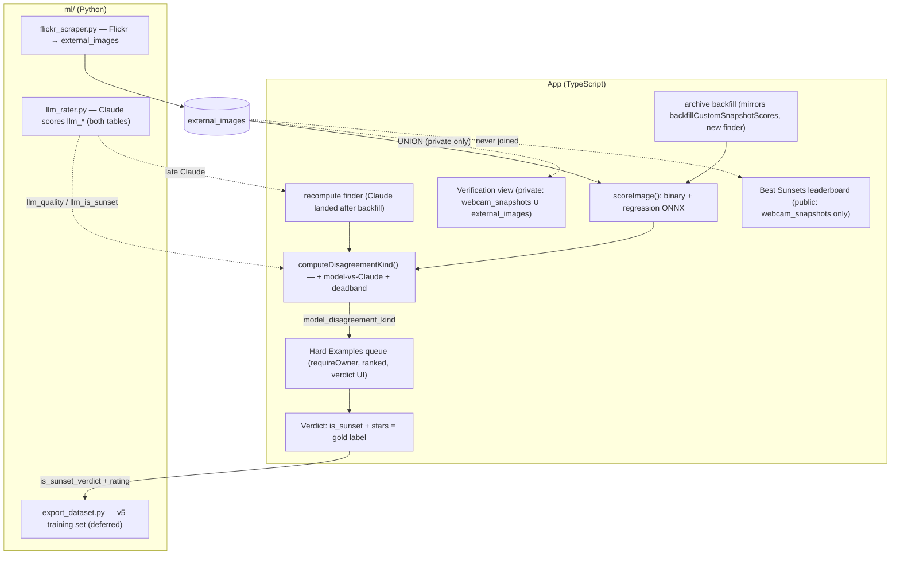

# feat: Three-judge hard examples + verification + leaderboard rating

## Summary

Make the Hard Examples queue work by giving every frame **three judge opinions** — the v4 binary head, the v4 regression head, and Claude (`claude-sonnet-4-5`) — and surfacing where they disagree for the operator to verdict (gold labels for v5). Backfill the v4 model over the ~33k webcam archive (writing real model scores into `ai_regression_score`), rank disagreements **model-vs-Claude** (Claude trusted), fix the public leaderboard's rating (Claude-primary, real-model fallback, Flickr structurally excluded), add a private verification view, ingest Flickr into the **existing `external_images` table** scored by all three, and keep flagging live binary-vs-regression disagreements. Sequenced into three phases. See origin: `docs/brainstorms/2026-06-04-three-judge-hard-examples-requirements.md`.

> **Revised 2026-06-04 after multi-persona review.** The first draft assumed Flickr would live in `webcam_snapshots` behind a `source` column. The codebase has neither: `webcam_snapshots` has no `source` column, and Flickr already has a dedicated `external_images` table (`database/migrations/20260417_external_images.sql`) that `ml/flickr_scraper.py` writes to and `ml/llm_rater.py` already scores. This revision adopts **external_images-in-place** for Flickr and corrects a phase-ordering hazard, a cleanup retention regression, a disagreement-recompute gap, a public-auth gap, and two UI-component gaps.

---

## Problem Frame

The Hard Examples queue is empty — `model_disagreement_kind` is set on 0 of 33,099 snapshots — because a disagreement needs two opinions and there's effectively one trustworthy one. Claude has scored ~29,705 archive frames (`llm_*`), but the v4 model never scored the archive (`ai_rating` is a junk legacy column with no model provenance; `ai_regression_score` is NULL on the Windy archive), and the binary head isn't enabled in Vercel, so the cron never flags live disagreements either. The v4 model has known blind spots (the Taltson silhouette case). The fix: give the model a real opinion on every frame, pit it against Claude, and route the gaps to the operator for gold verdicts that train v5.

The verdict *data capture* shipped 2026-06-02 (`webcam_snapshot_ratings.is_sunset_verdict` + `rating`, cleanup retention). But the verdict *UI* is not reachable from the hard-examples surface yet (see KTD7). This plan wires up the *detection* (three-judge scoring + disagreement), the *surfaces* (leaderboard rating, verification view, Flickr), and the *verdict UI routing* for the queue.

---

## High-Level Technical Design

Two codebases; Flickr lives beside the archive in its own table and is UNIONed only into private surfaces:

Disagreement is computed where both a model opinion and Claude's opinion exist on a snapshot. The operator's verdict is the only gold label; the model/Claude scores are inputs, never labels.

---

## Requirements

Trace to origin R1–R16.

**Three-judge scoring**
- R1. Frames carry all three judge outputs (binary verdict, regression rating, Claude verdict+quality). (origin R1)
- R2. The v4 model is backfilled over the full webcam archive, writing real per-snapshot scores into `ai_regression_score` (+ binary). (origin R2)
- R3. The cron flags live binary-vs-regression disagreements (binary enabled in prod). (origin R3)

**Hard Examples queue**
- R4. Hard examples are judge disagreements, ranked model-vs-Claude first; binary-vs-regression split secondary. (origin R4)
- R5. Queue surfaces highest-value disagreements first; operator pages through. (origin R5)
- R6. Operator verdicts (is_sunset + quality stars) = gold label; removes the frame from the queue. (origin R6)
- R7. Queue draws from both archive and Flickr. (origin R7)

**Verification surface**
- R8. Private operator view shows all three ratings side by side per frame. (origin R8)
- R9. Verification + Hard Examples share one backbone (default: one tab, "disagreements only" toggle). (origin R9)
- R10. Verification includes Flickr. (origin R10)

**Public leaderboard**
- R11. Webcam archive only — Flickr excluded. (origin R11)
- R12. Rank by Claude quality when present, fall back to the real regression rating. (origin R12)
- R13. Each card shows all available ratings. (origin R13)

**Flickr ingestion**
- R14. Flickr ingested into `external_images`, scored by all three, private surfaces only. (origin R14)
- R15. Claude run over Flickr where absent. (origin R15)

**v5 feed**
- R16. Operator verdicts accumulate as gold labels for v5; export/training deferred. (origin R16)

---

## Key Technical Decisions

- **KTD1. Mirror the `backfillCustomSnapshotScores` pattern, but with a NEW finder — the custom finder won't fit.** `customBackfill.ts` does download → `scoreImage` → `computeDisagreementKind` → write, paged + per-row-safe. Reuse that *shape*. But `findCustomSnapshotsNeedingScore` does `JOIN webcams w … WHERE w.source = 'custom'` — Windy archive rows don't match it. Write `findArchiveSnapshotsNeedingScore` selecting `webcam_snapshots WHERE ai_regression_score IS NULL AND firebase_url IS NOT NULL` (no `source` filter needed — every `webcam_snapshots` row is webcam-sourced; Flickr is in a different table). **The initial ~33k drain runs as a standalone bulk runner (`scripts/` / `ml/`), not the cron** — see KTD9.
- **KTD2. Disagreement gains a model-vs-Claude dimension with a deadband.** `computeDisagreementKind` (in `aiScoring.ts`) today compares binary-vs-regression only and takes `{binaryIsSunset, aiRating}`. Extend it to accept Claude (`llmQuality`, `llmIsSunset`) and emit model-vs-Claude kinds (model-low/Claude-high = **miss**; model-high/Claude-not-sunset = **false positive**), ranked above the binary-vs-regression split. **Apply a deadband around Claude's quality threshold** so borderline-vs-borderline frames (~4,691 of them) don't flood the queue — favor large, confident gaps. Thresholds compare against **normalized [0,1] `llm_quality`, not raw 1-5** (per the `normalized-vs-raw-thresholds` memory: 0.75 means "≥4 stars", not 4.0). It must still return a binary-vs-regression kind when Claude is absent, and **must not early-return null when `binaryIsSunset` is undefined** (the backfill computes model-vs-Claude offline before U8 enables binary).
- **KTD3. Claude scoring stays Python (`ml/llm_rater.py`), which already scores both tables.** The rater takes a `source_table` discriminator (`webcam` → `webcam_snapshots`, `external` → `external_images`). Running Claude over Flickr (R15) is the existing `--source external` path — no new Claude code, just a run. The TS side only *reads* `llm_*`.
- **KTD4. Leaderboard fallback ranks on the REAL model column, never junk `ai_rating`.** Rank by `llm_quality` when present; for Claude-null frames, include only those with `ai_regression_score IS NOT NULL` (real, post-backfill) and rank by it. **Never fall back to `ai_rating`** (junk provenance). The current query's `WHERE` is `llm_quality IS NOT NULL AND llm_is_sunset = true` — relaxing only the `llm_quality` clause still drops Claude-null frames (their `llm_is_sunset` is NULL, not `true`). Rewrite as a disjunction: `(llm_quality IS NOT NULL AND llm_is_sunset = true) OR (llm_quality IS NULL AND ai_regression_score IS NOT NULL AND ai_regression_score >= MODEL_SUNSET_MIN)` — the fallback needs its own regression sunset-positivity threshold since there's no Claude `is_sunset` for those frames. Consequence: the fallback path is inert until U3 backfills — U1 ships the Claude-primary ranking in Phase 1; the fallback becomes meaningful in Phase 2. Normalize both signals to [0,1] for one sort key (rank the raw `ai_regression_score` NUMERIC(4,3) [0,1] column, **not** the 1-5 `webcams.ai_rating_regression` display value) to avoid ordering discontinuities at the Claude/model boundary.
- **KTD4b. Per-snapshot model columns must be ADDED — `webcam_snapshots` lacks a binary column today.** `webcam_snapshots` has `ai_regression_score` + `ai_model_version_regression` + `scoring_path` + `model_disagreement_kind` (and `llm_*`, `llm_rated_at`), but the binary columns (`ai_rating_binary`, `ai_model_version_binary`) live only on `webcams`. There is **no** `scoring_state` column (the real one is `scoring_path`, with provenance semantics: `onnx`/`baseline`/`baseline-fallback`) and **no** `disagreement_computed_at`. A Phase-2 migration (in U3) adds to `webcam_snapshots`: `ai_binary_score`, `ai_binary_is_sunset`, `ai_model_version_binary` (persist the third judge, R1), `scoring_state` (dead-URL sentinel, distinct from `scoring_path`), and `disagreement_computed_at`. U5's migration adds the same set to `external_images`.
- **KTD5. Verification + Hard Examples share one tab; the three-judge card and the verdict-queue routing are NEW UI.** One operator tab, "disagreements only" toggle. But (a) `RatingCard`/`AiRatingDisplay` render a single merged verdict block — the leaderboard currently *fakes* Claude into the model slots; showing all three *distinctly* needs new props; and (b) `SnapshotConsole` only routes `mode==='unrated'` to the verdict card (`SnapshotQueueCard` with Yes/No+stars) — `mode==='hard-examples'` falls through to the grid path with no verdict UI. Both are real work (U1a, U4).
- **KTD6. Flickr lives in the existing `external_images` table, scored in place, private-only.** `external_images` (source/source_id/image_url/firebase_path/llm_*) already exists and is wired into the scraper + Python rater. Add the model-score columns to it (`ai_regression_score`, binary, `model_disagreement_kind`, versions) and point the TS backfill at it. Private surfaces (queue, verification) `UNION` `webcam_snapshots` + `external_images`. **The public leaderboard never joins `external_images`, so Flickr exclusion (R11) is structurally automatic — no `source` filter needed.**
- **KTD7. Verdict data capture exists; verdict UI routing for the queue does NOT.** `is_sunset_verdict` + `rating` columns + cleanup retention shipped 2026-06-02. But the Yes/No+stars UI is only wired for the unrated queue. U4 routes `hard-examples` to a verdict-capable card. Don't rebuild the storage; do build the routing.
- **KTD8. The public/private boundary is enforced server-side, not just by a hidden tab.** `/api/snapshots?mode=hard-examples` has **no auth today** — it's public. Add `requireOwner` to the queue/verification read branch (mirror `app/api/snapshots/[id]/rate/route.ts`). For the *public* surface, the boundary is already structural: the leaderboard is the only public route that reads snapshot data and it joins `webcam_snapshots ↔ webcams`, never `external_images` (no TS route references `external_images` at all today). So the Phase-1 enforcement is an **inline structural comment** in the leaderboard route, not a new shared module (one consumer — a shared helper would be a speculative abstraction). **Trigger:** if a second public route that reads snapshot data is ever added, promote enforcement to a Postgres view (public-only) or RLS on `external_images` — recorded in Scope Boundaries.
- **KTD9. The initial 33k drain is a standalone bulk runner; the cron handles steady-state only.** At `*/15` with live Windy scoring consuming the 50s tick deadline first, the paged-cron drains ~10–50 rows/tick → 1–3 weeks for 33k, and the ONNX bundle already hovers near Vercel's 250 MB cap (origin warned of this). Run the one-time backfill as a script with full ONNX; keep a small paged top-up in the cron for newly-captured frames.

---

## Implementation Units

### Phase 1 — Leaderboard rating + three-judge card (TS only, ships first)

### U1a. Three-judge display surface on RatingCard
- Goal: Let `RatingCard`/`AiRatingDisplay` show binary verdict + regression rating + Claude verdict/quality as **distinct** signals (not Claude proxied into model slots).
- Requirements: R13, R8 (shared with U7)
- Dependencies: none
- Files: `app/lib/types.ts` (`WindyWebcam`), `app/components/Webcam/RatingCard.tsx`, `app/components/Webcam/AiRatingDisplay.tsx`, tests alongside.
- Approach: **Pin the contract on `WindyWebcam`** (the single object `RatingCard` already takes) so all three call sites (U1 leaderboard, U4 queue, U7 verification) populate the same shape via their own adapters: add `llmQuality: number | null`, `llmIsSunset: boolean | null`, `llmModel: string | null`. `AiRatingDisplay` renders the existing binary+regression block plus a **distinct labeled Claude section**. Render Claude's quality as a **normalized percentage readout** (e.g. "Claude: Sunset · 87%"), **not** 1-5 stars — the `Stars` widget is a 1-5 scale and `llm_quality` is [0,1]; proxying it through stars is exactly the faking U1a removes. When a judge is absent, omit its section entirely (no placeholder). Stop `LeaderboardTab.entryToWebcam` from faking Claude into `aiRatingBinary/aiRatingRegression`; set the new `llm*` fields instead.
- Patterns to follow: existing `AiRatingDisplay` verdict block.
- Test scenarios:
  - All three present → three distinct sections render; Claude shows a % readout, not stars.
  - Claude present, model absent (pre-backfill) → only the Claude section renders; no empty model placeholder.
  - Binary absent (pre-U8) → regression + Claude render; no binary verdict.
- Verification: A card renders up to three independent judge readouts from one `WindyWebcam`; missing judges are silently omitted.

### U1. Leaderboard: Claude-primary, real-model fallback, all ratings shown
- Goal: Rank the public board by Claude when present, fall back to the **real** regression score (never junk `ai_rating`), show every available rating, keep Flickr structurally out.
- Requirements: R11, R12, R13
- Dependencies: U1a
- Files: `app/api/leaderboards/route.ts`, `app/components/Leaderboard/LeaderboardTab.tsx`, tests alongside.
- Approach: Rewrite the `WHERE` as the KTD4 disjunction — `(llm_quality IS NOT NULL AND llm_is_sunset = true) OR (llm_quality IS NULL AND ai_regression_score IS NOT NULL AND ai_regression_score >= MODEL_SUNSET_MIN)` — so Claude-null frames with a real model score appear (the existing `AND llm_is_sunset = true` would otherwise drop them). Rank by the normalized unified key (`llm_quality` when present, else `ai_regression_score`). Add `ai_regression_score` to the column allow-list; pass real Claude + model values to the U1a card. **Do not add a Flickr filter** — the query only touches `webcam_snapshots JOIN webcams`; `external_images` is never reached. Add a code comment noting Flickr exclusion is structural (KTD8). Keep CDN caching (note: `s-maxage=60` delays observing the change post-deploy).
- Patterns to follow: existing `app/api/leaderboards/route.ts`.
- Test scenarios:
  - Covers R12. Frame with Claude → ranked by Claude; Claude-null frame with real `ai_regression_score` → ranked by it; Claude-null AND `ai_regression_score` NULL → **does not appear** (locks out the junk-fallback hazard).
  - Covers R11. A row in `external_images` never appears in leaderboard results.
  - Covers R13. Card shows all available ratings; absent ones omitted.
- Verification: Board ranks Claude-first, falls back only to real model scores, and shows no Flickr.

### Phase 2 — Archive model backfill + model-vs-Claude queue

### U2. Model-vs-Claude disagreement dimension + deadband + ranking
- Goal: Extend `computeDisagreementKind` to model-vs-Claude with a borderline deadband and a priority weight.
- Requirements: R4
- Dependencies: none (pure logic); consumed by U3/U3b/U4
- Files: `app/api/cron/update-cameras/lib/aiScoring.ts` (`computeDisagreementKind`), `app/lib/masterConfig.ts` (new thresholds, named in normalized [0,1] space), tests alongside.
- Approach: Accept `{binaryIsSunset?, aiRating?, llmQuality?, llmIsSunset?}`. Emit **miss** (model-low + Claude-high-quality-sunset) and **false-positive** (model-high + Claude-not-sunset) kinds when a model score and Claude both exist. Apply a deadband: suppress a model-vs-Claude flag when Claude's quality sits within ±`MODEL_VS_CLAUDE_DEADBAND` of its sunset threshold (borderline frames aren't model failures). Priority ordering: model-vs-Claude kinds rank above binary-vs-regression. Remove the early `return null` when `binaryIsSunset` is undefined so the offline backfill still computes model-vs-Claude. Keep it pure.
- Execution note: Thresholds compare against normalized `llm_quality` (0.75 = "≥4 stars"), per the `normalized-vs-raw-thresholds` memory — name the constants accordingly.
- Test scenarios:
  - Claude high-quality sunset + model low → **miss**.
  - Model high + Claude not-a-sunset → **false positive**.
  - Both Claude and model near threshold (within deadband) → **no flag** (skew guard).
  - Claude absent → binary-vs-regression kind only; both absent → null.
  - `binaryIsSunset` undefined but model + Claude present → still emits model-vs-Claude (no early null).
  - A large confident gap outranks a near-threshold straddle and a binary-vs-regression kind.
- Verification: Unit tests cover all kinds, the deadband, the undefined-binary path, and precedence.

### U3. Backfill the v4 model over the webcam archive (standalone runner)
- Goal: Score every archive snapshot lacking a real model score with binary + regression, persist all three judge columns, compute disagreement; drain terminates and never writes fallback junk.
- Requirements: R1, R2 (enables R4)
- Dependencies: U2
- Files: `database/migrations/<new>_webcam_snapshots_model_columns.sql` (the KTD4b columns: `ai_binary_score`, `ai_binary_is_sunset`, `ai_model_version_binary`, `scoring_state`, `disagreement_computed_at` — added to `webcam_snapshots`), `app/api/cron/update-cameras/lib/dbOperations.ts` (`findArchiveSnapshotsNeedingScore` + extend `updateSnapshotAiRegressionScore` to also write the binary fields + `disagreement_computed_at`), a backfill module mirroring `customBackfill.ts`, a standalone entry (`scripts/backfill-archive-scores.ts`, run via `tsx` + `tsconfig-paths`), a paged top-up call in `app/api/cron/update-cameras/route.ts`, tests alongside.
- Approach: **Migration first** (KTD4b) — the finder/writer reference columns that don't exist yet. `findArchiveSnapshotsNeedingScore` selects `webcam_snapshots WHERE ai_regression_score IS NULL AND firebase_url IS NOT NULL AND scoring_state IS DISTINCT FROM 'dead-url'` (no `webcams` JOIN, no `source` filter — all `webcam_snapshots` rows are webcam-sourced). For each: download, `scoreImage` (both heads), `computeDisagreementKind`, write **all three judge columns + `disagreement_computed_at = now()`**. **Gate the write on `pathTaken === 'onnx'`** — if the ONNX path fell back to baseline, count it and abort the run rather than backfilling 33k fake scores (silent-ML-fallback memory). **Mark a permanently-failed image (404/dead URL) with `scoring_state='dead-url'`** (a new column distinct from the provenance `scoring_path`) so the finder excludes it and the drain terminates. **The finder also picks up unscored `source='custom'` rows** (no source filter) — so the cron top-up here **subsumes and replaces** the existing `backfillCustomSnapshotScores` cron pass; remove the separate custom pass to avoid two finders double-selecting + racing the same row (and keep the `updateWebcamRegressionScoreFromLatestCustomSnapshot` webcam-sync for custom rows). Run the initial 33k drain via the standalone runner (full ONNX, no Vercel time/bundle limit; scoped backfill DB credential with INSERT/UPDATE only + a 1-2 connection pool, not the app's pool).
- Execution note: First run a counting dry-run (rows needing score + estimated ONNX inferences + Neon writes) behind a `masterConfig` gate; confirm `fallbacks === 0` before the live drain.
- Test scenarios:
  - Happy: a NULL-score archive row gets all three judge columns written, `disagreement_computed_at` set, and (when it disagrees with Claude) flagged.
  - Edge: a 404 row is marked `scoring_state='dead-url'` and is NOT re-selected on the next pass (drain terminates).
  - Edge: a baseline-fallback result (`pathTaken !== 'onnx'`) is NOT written; the run aborts + alerts.
  - Edge: an unscored `custom` row is scored by the unified finder (no separate custom pass double-selects it).
  - Paging: the finder respects the limit; repeated passes drain the backlog.
- Verification: `count(ai_regression_score IS NOT NULL)` climbs to ~33k; no `dead-url` re-fetch loop; one finder owns all rows; Hard Examples populates.

### U3b. Disagreement recompute + cleanup retention repoint
- Goal: (a) Re-flag frames whose Claude score lands *after* the model backfill; (b) stop the backfill from silently changing what cleanup retains.
- Requirements: R4 (recompute completeness), R2 (safe write)
- Dependencies: U2, U3
- Files: `app/api/cron/update-cameras/lib/dbOperations.ts` (`findSnapshotsNeedingDisagreementRecompute`), `vercel.json` + a dedicated recompute cron route (or a reserved-budget pass in `update-cameras/route.ts`), `app/api/snapshots/cleanup/route.ts`, `app/lib/masterConfig.ts`, tests alongside.
- Approach: **Recompute — commit to the timestamp mechanism, NOT a Python-rater flag.** `webcam_snapshots.llm_rated_at` already exists (`20260417`). The finder selects `WHERE ai_regression_score IS NOT NULL AND llm_quality IS NOT NULL AND (disagreement_computed_at IS NULL OR disagreement_computed_at < llm_rated_at)` and re-runs `computeDisagreementKind`, stamping `disagreement_computed_at = now()`. This needs no change to `ml/llm_rater.py` (KTD3 forbids it; the "flag the rater sets" alternative is unimplementable without editing the rater and is **dropped**). This path catches the ~3,400 originally-Claude-absent frames (the hardest ones). **Run it on its own cron schedule (or a reserved per-tick budget slice) so live Windy scoring can't starve it** — it is the highest-value, most-starvable pass; emit a `recomputed/tick` counter (mirror the `fallbacks` counter) so starvation is visible. **Cleanup:** repoint retention from `ai_rating >= AI_SNAPSHOT_MIN_RATING_THRESHOLD` to `ai_regression_score >= …`. Note: U3's writer never touches `ai_rating` (it writes `ai_regression_score`), so this is forward-looking correctness — once backfilled, retention should read the real signal, not the junk legacy column. Confirm the writer leaves `ai_rating` untouched.
- Execution note: Cleanup is gated off (`CLEANUP_ENABLED=false`); the retention repoint is a latent-correctness fix — land it with U3 so the System-Wide claim holds.
- Test scenarios:
  - A frame scored by the model while Claude-absent, then later Claude-scored (so `llm_rated_at > disagreement_computed_at`), is picked up by the recompute finder and flagged.
  - A frame already correctly flagged (`disagreement_computed_at >= llm_rated_at`) is not redundantly recomputed.
  - Cleanup retains a frame with high `ai_regression_score` regardless of its `ai_rating`.
- Verification: Late-Claude frames enter the queue; the recompute pass is not starved by live scoring; no protected frame becomes deletion-eligible after backfill.

### U4. Hard Examples queue: ranking + server auth + verdict UI + membership invariant
- Goal: Rank model-vs-Claude first, gate the endpoint server-side, route the queue to a verdict-capable card, and define stable queue membership.
- Requirements: R4, R5, R6, R7, R16 (verdict → gold label; storage shipped 2026-06-02, this unit wires the UI that writes it)
- Dependencies: U1a, U2, U3
- Files: `app/api/snapshots/route.ts` (`mode="hard-examples"` query + `requireOwner`), `app/components/SnapshotConsole.tsx` + the store slice (route `hard-examples` to the verdict card), `app/lib/owner.ts` (reuse), tests alongside.
- Approach: **Auth:** call `requireOwner()` at the top of the `hard-examples` branch (mirror `app/api/snapshots/[id]/rate/route.ts`); the client store must treat the resulting 401 as "sign in", not a generic error. **Ranking:** `ORDER BY` disagreement-kind priority (model-vs-Claude first), then magnitude, then recency. **Verdict UI — reuse `SnapshotQueueCard`, don't fork:** widen `isQueueMode` to include `'hard-examples'` and **parameterize the remove action by mode** — `handleQueueRate` currently calls `removeUnratedSnapshot` directly; pass an `onRemove` keyed to the mode so hard-examples verdicts remove from the `hardExamples` store slice (add a `removeHardExample` action), not the unrated slice. The card renders the U1a three-judge display + Yes/No + stars; the hotkey `useEffect` (gated on `isQueueMode`) then covers both modes. **Membership invariant:** queue = `model_disagreement_kind IS NOT NULL` **MINUS** `s.id IN (SELECT snapshot_id FROM webcam_snapshot_ratings WHERE is_sunset_verdict IS NOT NULL)` — **drop the `user_session_id` predicate from the subquery body entirely** (not just the `hardExamplesUserSessionId ?` wrapper at lines 91-97; single operator). A verdicted frame stays out permanently — the recompute (U3b) must not resurrect it.
- Test scenarios:
  - Covers R5. Model-vs-Claude disagreements rank ahead of binary-vs-regression.
  - Covers R6/R16. Verdict (Yes + stars) persists the gold label, removes the frame from the `hardExamples` slice, and the verdict UI is reachable in hard-examples mode.
  - Auth: unauthenticated `GET /api/snapshots?mode=hard-examples` → 401; the client shows a sign-in affordance, not an error block.
  - Membership: a verdicted frame is excluded with NO `user_session_id` supplied; it does not re-enter after a later U3b recompute.
- Verification: Top of the queue is the model's worst confident misses; verdicting advances it (correct slice); the endpoint rejects non-owners.

### Phase 3 — Flickr ingestion + verification

### U5. Ingest Flickr into `external_images` (with URL validation)
- Goal: Land/confirm the Flickr corpus in the existing `external_images` table, validated and private-only.
- Requirements: R14
- Dependencies: none
- Files: `database/migrations/<new>_external_images_model_columns.sql` (add the KTD4b set to `external_images`: `ai_regression_score`, `ai_binary_score`, `ai_binary_is_sunset`, `ai_model_version_regression`, `ai_model_version_binary`, `model_disagreement_kind`, `scoring_state`, `disagreement_computed_at` — mirror what U3 adds to `webcam_snapshots`), `ml/flickr_scraper.py` (confirm ingestion + add host validation), tests/checks alongside.
- Approach: Reuse the existing `external_images` schema + `flickr_scraper.py` (already writes `source='flickr'`). Add the model-score columns the TS backfill (U6) will fill. **Capture display metadata at ingest** — `title` and `owner` (these become the card label for Flickr frames in U7, which have no webcam/location). **Validate at ingest:** accept only `https://` `image_url`s on known Flickr CDN hosts (`*.staticflickr.com`); length/charset-sanitize `title`/`owner` before insert. Add the same host check to `flickr_scraper.py`'s `download_image()` (currently `requests.get(url)` with no validation) as defense-in-depth at the source. Confirm whether the table fetches `image_url` or a Firebase `firebase_path` (U6 must validate whichever it fetches — see U6).
- Execution note: Flickr-over-Claude spend is estimated in U6; ingestion itself is cheap.
- Test scenarios:
  - An ingested Flickr row is queryable in `external_images` with a valid `image_url`, `title`, and `owner`.
  - A row with a non-Flickr-CDN or non-https `image_url` is rejected at ingest (both the TS path and `download_image`).
  - Covers R11. `external_images` rows are absent from the leaderboard query (structural).
- Verification: Flickr rows present in `external_images`, validated, with display metadata, never on the public board.

### U6. Score Flickr with all three judges
- Goal: Run binary+regression (TS backfill over `external_images`) and Claude (`ml/llm_rater.py --source external`) over Flickr; SSRF-safe downloads.
- Requirements: R1, R7, R15
- Dependencies: U3 (backfill module), U5 (Flickr rows + columns)
- Files: `app/api/cron/update-cameras/lib/dbOperations.ts` (`findExternalImagesNeedingScore` variant — no `webcams` JOIN, tolerates null webcam_id), the backfill module (accept an `external_images` target + a `'flickr'`/neutral source for `scoreImage`'s `WebcamSource` union), `ml/llm_rater.py` (existing `--source external` run).
- Approach: Add an `external_images`-targeted finder/writer to the backfill. The external writer **must NOT call `updateWebcamRegressionScoreFromLatestCustomSnapshot`** (no `webcams` row exists for a Flickr image) — keep two distinct writers (archive → `webcam_snapshots` + webcam-sync; external → `external_images` only). Extend `scoreImage`'s `WebcamSource` union (`'windy' | 'custom'`) to include `'flickr'` (or thread a neutral source; `webcamId` is only used for log/cache keys — supply a synthetic id for null-webcam rows). **Apply the same `pathTaken === 'onnx'` write gate** (a Flickr baseline-fallback must not write fake scores). **SSRF: fetch `external_images.image_url` (the Flickr CDN URL), not `firebase_path`; validate the host against `*.staticflickr.com` immediately before the request.** Run `ml/llm_rater.py --source external` to populate `llm_*` (it **overwrites** any stale `llm_model` from older providers in legacy `external_images` rows); the U3b recompute path (run over `external_images` too) then computes disagreement for Flickr.
- Execution note: Claude-over-Flickr is Anthropic spend — count `external_images` rows + estimate before running.
- Test scenarios:
  - The external writer scores a Flickr row and does NOT mutate any `webcams` row.
  - A `pathTaken !== 'onnx'` result is not written for Flickr either.
  - SSRF: `image_url` is the fetch target; `firebase_path` is never passed to the downloader; a non-allowlisted host is rejected before the request.
  - `Test expectation: verify-by-run` for `ml/llm_rater.py --source external` — `llm_*` populated, spot-checked, stale `llm_model` overwritten.
- Verification: Flickr rows carry all three judge outputs; Flickr disagreements enter the (private) queue; no webcam row is mutated.

### U7. Verification view (one tab, disagreements-only toggle, unions Flickr)
- Goal: A private operator surface showing all three ratings side by side across archive + Flickr, with a toggle that narrows to disagreements.
- Requirements: R8, R9, R10
- Dependencies: U1a, U2, U3, U4, U6
- Files: `app/HomeClient.tsx` (operator tab — owner-session-gated render), `app/components/SnapshotConsole.tsx` (verification mode + toggle), `app/api/snapshots/route.ts` (a private read that `UNION`s `webcam_snapshots` + `external_images`, `requireOwner`-gated), `app/lib/types.ts` (a unified `SnapshotRow` tolerating null webcam fields), tests alongside.
- Approach: One operator tab gated by `requireOwner` **server-side** AND rendered only after an owner-session check client-side (not present in the DOM for non-owners). Toggle **defaults OFF** (browse — returns ALL frames with no judge-count filter; absent judges omitted per U1a; this is the "eyeball judge coverage" use-case); toggle ON = the ranked U4 disagreement queue with verdict actions. **UNION projection contract:** the two tables have different columns (`external_images` has no `webcam_id`/location/`phase`/`rank`); the read explicitly **NULL-pads the webcam-only columns** for the `external_images` leg, and `transformSnapshot`/`SnapshotRow` must tolerate null `webcam_id`/location. **Flickr card label:** since Flickr frames have no webcam title/location, the card shows a source badge + `external_images.title`/`owner` (captured in U5) — e.g. "Flickr · <title>" — so the operator can tell a Flickr frame from an archive frame while verdicting. Empty state for toggle-ON: a contextual message ("No disagreements yet — backfill still running or all verdicted").
- Test scenarios:
  - Covers R8. Each row shows all three ratings (U1a card).
  - Covers R9. Toggle narrows to disagreements and back; default is browse (OFF); browse shows single-judge frames too (no judge-count filter).
  - Covers R10. Flickr frames appear here (labeled "Flickr · …", no blank location) but never on the public board.
  - Auth: unauthenticated request to the union endpoint → 401; the tab is absent from the DOM for non-owners.
  - UNION: an `external_images` row round-trips through the UNION + `transformSnapshot` without throwing on null `webcam_id`/location.
  - Empty: toggle ON with zero disagreements shows the contextual message, not a blank grid.
- Verification: The tab shows the three-judge comparison across archive + Flickr; Flickr rows are labeled and render without webcam metadata; the toggle switches browse↔queue; non-owners get nothing.

### Ongoing

### U8. Enable the binary head in Vercel + confirm live flagging
- Goal: Turn on live binary-vs-regression disagreement flagging in prod.
- Requirements: R3
- Dependencies: none (but note: U3's archive disagreements are model-vs-Claude, computed offline without binary — U8 is what lights up the *live binary-vs-regression* dimension)
- Files: Vercel env (`AI_BINARY_SCORING_ENABLED=true`) — config, not code.
- Approach: Set the env var; verify via the `scoring-smoke` endpoint that the binary head loads (real ONNX latency, not a silent fallback) and the cron persists live disagreements.
- Test scenarios: `Test expectation: config + verify-by-run` — smoke shows `binaryIsSunset` present + real ONNX latency; a live disagreement appears after a tick.
- Verification: `fallbacks === 0`, binary verdict present, live disagreements accrue.

---

## Scope Boundaries

**Deferred for later** (origin-carried)
- v5 dataset export + training (`ml/export_dataset.py` integration) — labels are collected/marked now; export when v5 is trained.
- Multi-rater majority semantics — single operator.

**Deferred to follow-up work** (plan-local)
- Reverse-geocoding Flickr/missing locations for the per-country leaderboard grouping.
- A DB-level enforcement of the public/private boundary (Postgres view or RLS) beyond the centralized base query + `requireOwner` — revisit if more public routes are added.

**Outside this product's identity** (origin-carried)
- Flickr / training data on the public surface — never.

---

## System-Wide Impact

- **Two-codebase coordination.** Binary/regression in TS, Claude in Python `ml/` (already dual-table aware). TS reads `llm_*`, never writes it. The U3b recompute path is the bridge that re-fires disagreement after a manual Claude run.
- **`ai_regression_score` becomes the model's real signal.** The leaderboard fallback (U1) and cleanup retention (U3b) both move off junk `ai_rating` onto it. `ai_rating` is left as-is (legacy); nothing new should read it.
- **Public/private boundary.** Public surfaces touch only `webcam_snapshots`; private surfaces `UNION` `external_images`. The boundary is enforced by `requireOwner` on the read endpoints (KTD8), not just query hygiene.
- **Cost.** The standalone backfill is one-time ONNX + Neon writes (gated, fallback-checked); Claude-over-Flickr is Anthropic spend (estimated first).
- **Retention.** After U3b, verdicted + disagreement + high-`ai_regression_score` rows survive cleanup; the backfill no longer changes the protected set.

---

## Risks & Dependencies

- **Silent-ML fallback during backfill.** 33k images through two ONNX heads; if the bundle/runtime falls back to baseline it would write fake scores fast. Mitigated by the `pathTaken === 'onnx'` write gate + dry-run `fallbacks === 0` check (U3) + standalone runner (KTD9).
- **Two-codebase recompute timing.** Disagreement is only as complete as the recompute pass (U3b); if the "Claude landed" signal isn't wired, late-Claude frames never flag. U3b makes this explicit.
- **Scale-mixing in the leaderboard.** Claude `llm_quality` (0-1) vs regression rating (1-5) — normalize to one [0,1] key (U1/KTD4) to avoid ordering discontinuities.
- **Claude-over-Flickr spend** — quantify before running `ml/llm_rater.py --source external` (U6).
- **Schema migrations are prerequisites, not afterthoughts.** U3's finder/writer and U3b's recompute reference columns (`scoring_state`, `disagreement_computed_at`, the binary trio) that don't exist — the Phase-2 migration (U3) must land before the finders; U5's mirror migration on `external_images` must land before U6.
- **Cron budget contention.** Live Windy scoring consumes the 50s tick deadline first; the archive top-up + recompute pass + (now-subsumed) custom backfill compete for the remainder. The recompute pass (highest value, catches the hardest frames) gets its own schedule / reserved slice + a `recomputed/tick` counter so starvation is visible (U3b).

---

## Acceptance Examples

- AE1. After the backfill, opening Hard Examples shows model-vs-Claude disagreements ranked above binary-vs-regression ones, and borderline-vs-borderline frames are not flooding the top. (U2, U3, U4)
- AE2. Verdicting a frame (Yes + 4 stars) writes the gold label to `webcam_snapshot_ratings` and removes it from the queue — and the verdict UI is reachable in hard-examples mode. (U4)
- AE3. The public leaderboard ranks a frame by Claude when present, by the **real** model score when Claude is absent, never ranks by junk `ai_rating`, and never shows a Flickr frame. (U1)
- AE4. The verification tab shows all three ratings for a frame (incl. Flickr) and rejects non-owners at the API; the "disagreements only" toggle narrows to the queue. (U7)
- AE5. An unauthenticated `GET /api/snapshots?mode=hard-examples` returns 401. (U4)

---

## Open Questions

**Resolved by review (round 1 + round 2)**
- ~~Flickr storage + identity~~ → `external_images` in place, scored by all three, UNIONed into private surfaces only (KTD6).
- ~~Leaderboard fallback column / WHERE~~ → disjunction admitting `ai_regression_score IS NOT NULL` Claude-null frames, never `ai_rating` (KTD4, U1).
- ~~Missing schema columns~~ → a Phase-2 migration adds binary + `scoring_state` + `disagreement_computed_at` to `webcam_snapshots` (U3) and `external_images` (U5) — these columns don't exist today (KTD4b).
- ~~Recompute signal mechanism~~ → `disagreement_computed_at < llm_rated_at` (both columns on `webcam_snapshots`); no Python-rater edit (U3b).
- ~~`isQueueMode` fork~~ → reuse `SnapshotQueueCard`, parameterize the remove action by mode + add `removeHardExample` (U4).
- ~~U1a prop contract~~ → on `WindyWebcam`; Claude shown as a % readout, not stars (U1a).
- ~~UNION column alignment / Flickr card label~~ → NULL-pad webcam columns, source badge + title/owner for Flickr (U7).
- ~~Verification toggle default / partial-data render~~ → default OFF, browse returns all frames; absent judges omitted (U1a, U7).
- ~~Public boundary enforcement~~ → inline structural comment now (one consumer); Postgres view/RLS triggered by a 2nd public snapshot route (KTD8).

**Deferred to implementation**
- Exact model-vs-Claude thresholds, the deadband width, and the ranking-weight formula (U2) — in normalized [0,1] space.
- `MODEL_SUNSET_MIN` value for the leaderboard fallback's sunset-positivity gate (U1/KTD4).
- Backfill page size for the cron top-up + the recompute pass's schedule/budget slice (U3/U3b); the standalone runner is unbounded.
- Whether the private read `UNION` is one endpoint with a mode param or two (U7).

---

## Sources / Research

- Origin: `docs/brainstorms/2026-06-04-three-judge-hard-examples-requirements.md`
- Prior design: `docs/superpowers/specs/2026-06-02-hard-example-mining-and-private-labeling-design.md` (verdict capture, retention — shipped)
- `STRATEGY.md` Track 1; memories: `project_snapshot_rating_provenance`, `normalized-vs-raw-thresholds`, `silent-ml-fallback`, `vercel-nextjs-ml-bundling`
- Schema: `database/migrations/20260417_external_images.sql` (Flickr table), `20260503_cameras_schema.sql` (`source` is on `webcams`, not `webcam_snapshots`)
- Patterns: `app/api/cron/update-cameras/lib/customBackfill.ts`, `app/api/cron/update-cameras/lib/aiScoring.ts` (`scoreImage`, `computeDisagreementKind`, `WebcamSource`), `app/api/cron/update-cameras/lib/dbOperations.ts` (`findCustomSnapshotsNeedingScore`), `app/api/cron/update-cameras/route.ts` (tick deadline), `app/api/snapshots/route.ts` (`mode="hard-examples"`, session-scoped exclusion), `app/api/snapshots/[id]/rate/route.ts` (`requireOwner`), `app/api/snapshots/cleanup/route.ts` (retention), `app/api/leaderboards/route.ts`, `app/components/SnapshotConsole.tsx` (`isQueueMode`), `app/components/Webcam/RatingCard.tsx` / `AiRatingDisplay.tsx`, `ml/llm_rater.py` (`--source` dual-table), `ml/flickr_scraper.py`, `ml/export_dataset.py`
